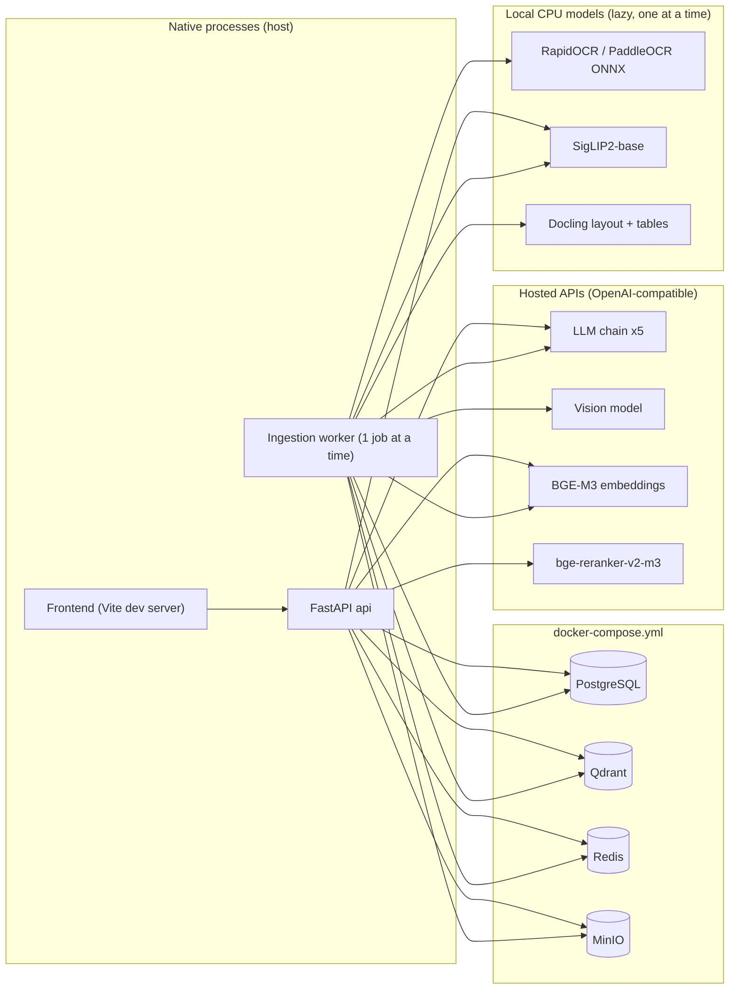
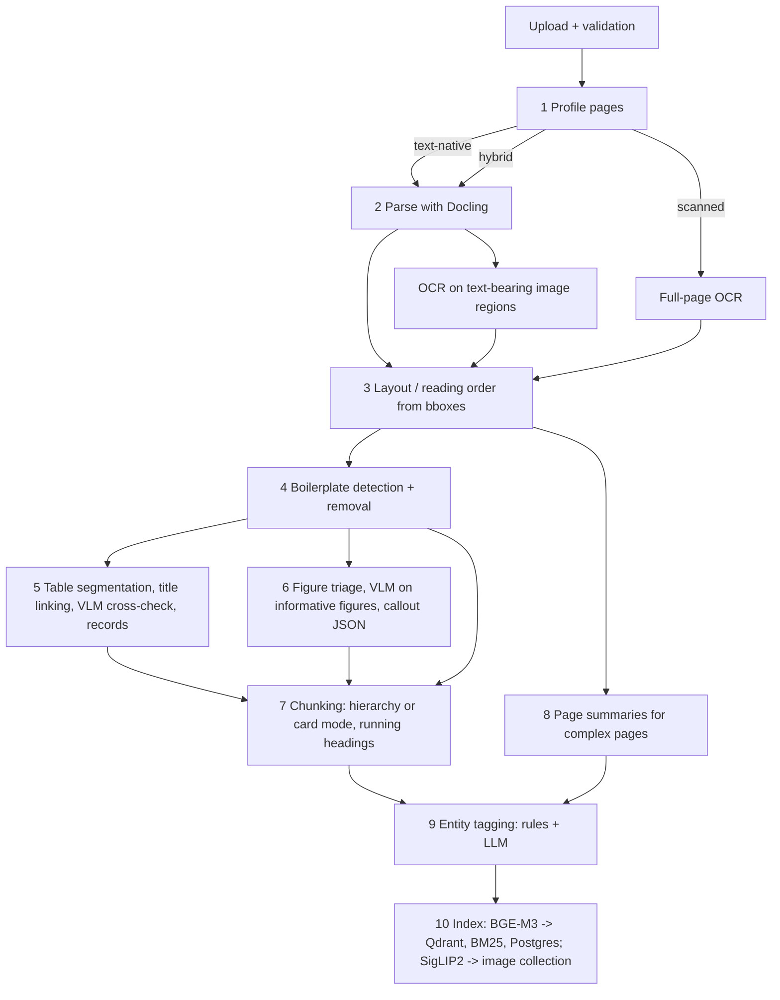
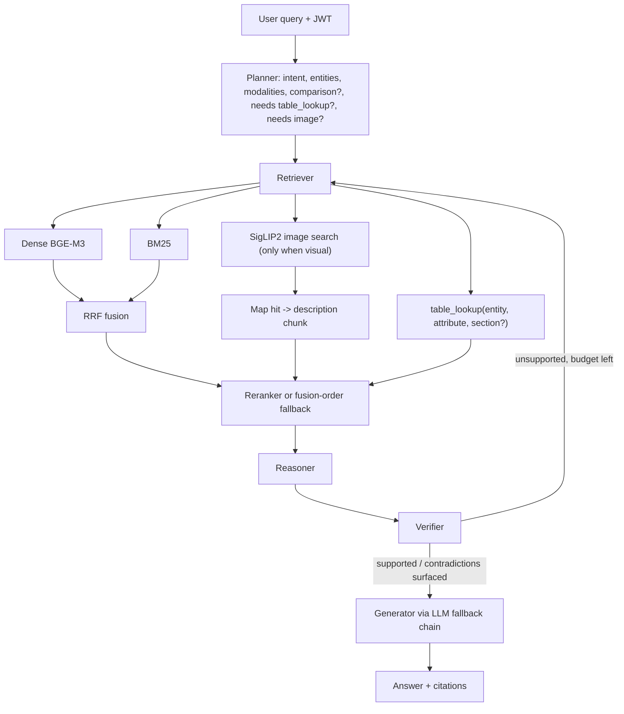

# DocMind Architecture

Written in Phase 0 after reading `docs/DocMind_Plan.pdf` (28 pages) and Addenda A2/A3.
Where the plan and the addenda differ, the addenda win (see `DECISIONS.md`).

## 1. What we are building

DocMind answers natural-language questions over enterprise documents (manuals,
brochures, spec sheets, scanned pages). It must understand text, tables, figures,
and scanned content. Every answer comes with lightweight citations (document + page).
It has two halves:

1. **Ingestion.** This side is asynchronous and runs per document with per-stage status.
   It turns a PDF into searchable evidence: text chunks, table records, figure descriptions,
   page summaries, and image vectors.
2. **Query.** A LangGraph workflow plans the query, retrieves evidence (hybrid + structured
   + optional visual), reranks it, reasons over it, and verifies the draft.
   Then it generates a cited answer through an ordered LLM fallback chain.

The UI (React + Framer Motion) shows a dashboard, document management, and chat
with citations. It never shows agent internals.

## 2. Runtime topology (development, `HARDWARE_PROFILE=cpu_8gb`)

`docker-compose.full.yml` adds `api`, `worker` and `frontend` containers for a demo build.

## 3. Data stores

| Store | Holds |
|---|---|
| PostgreSQL | users, documents, document versions, ACLs, ingestion jobs + per-stage status/timings, `page_profiles`, `table_records`, figures, document-level metadata (boilerplate), conversations, messages, access log |
| Qdrant `docmind_text` | 1024-d BGE-M3 vectors for every text-like chunk (block/card, table record, row group, figure description, page summary) with payload: `document_id`, `owner_id`, `allowed_user_ids`/groups, `page`, `section`, `heading_path`, `chunk_type`, `entities`, `bbox`, `figure_id`/`table_id` |
| Qdrant `docmind_images` | SigLIP2 vectors (normalised, cosine) for triaged figure crops only, linked to their description chunk |
| BM25 index | the same text chunks, after boilerplate removal (built in-process per permitted corpus and persisted; see risks) |
| Redis | job queue / status pub-sub, rate limiting, short-lived query cache |
| MinIO | original files, page rasters, figure crops, debug artefacts |
| Disk cache (`CACHE_DIR`) | parsed output, OCR, VLM descriptions and embeddings keyed by content hash |

## 4. Ingestion pipeline (A2 + A3 applied)

Each stage is a pure-ish function `stage(doc_ctx) -> doc_ctx`. Each stage has its own status
row and timing. The cache key is the content hash plus the stage config. That makes re-runs cheap.

1. **Profile (A2.1).** For each page, measure text-layer characters, image-area ratio,
   estimated column count, a reading-order sanity score, and a scanned flag.
   Route each page to `text_native | hybrid | scanned`. Store the result in `page_profiles`.
   A healthy text layer never goes to full-page OCR.
2. **Parse.** Docling gives structure, bounding boxes, and tables. We probe it on the
   benchmark first (outputs go to `benchmark/debug/`).
3. **OCR (A2.2).** Full-page OCR runs on scanned pages. Region OCR runs on image regions
   that may hold text (badges, UI screenshots, labelled renders). The backend is
   PaddleOCR-family ONNX models. First we check Docling's RapidOCR integration.
4. **Reading order (A2.3).** Text-stream order is not trusted. Order is rebuilt from bboxes
   with column detection. A unit test on page 2 asserts that each model's bullets
   stay under that model.
5. **Boilerplate (A2.4).** Find repeated header and footer lines across pages after
   normalisation (digits and whitespace stripped, fuzzy match). Remove them from chunks
   and BM25. Store them once as document metadata.
6. **Tables (A2.5).** Segment tables by spatial gaps and never merge across them. Link each
   title by bbox proximity. On table-heavy pages, cross-check against the page raster with
   the VLM. Every VLM number must exist in the text layer or OCR output; anything else is
   flagged. Rows become `table_records(document_id, page, table_id, entity, section,
   attribute, value, unit_variants, footnotes)`. Each record is also indexed as its own chunk
   with a context prefix. Large tables are split into row groups that repeat the header.
   Footnote markers are linked to the rows or values they qualify.
7. **Figures (A2.6, A3.2).** Classify each image as one of: informative diagram, labelled
   render, UI screenshot, product photo, decorative, logo/badge. Only the first three get
   full VLM analysis. That analysis is structured JSON for labelled diagrams and legends,
   using the image crop plus nearby text-layer labels. Results are cached by image hash,
   and each document has a VLM call budget. Path 1 builds a description chunk
   (VLM + OCR + caption) and embeds it with BGE-M3. Path 2 runs SigLIP2 on triaged crops only.
8. **Page fallback (A2.7).** Complex pages also get a `page_summary` chunk from a VLM read
   of the raster.
9. **Chunking (A2.9).** Use hierarchy-aware chunking when headings are strong. Fall back to
   card-per-layout-block when hierarchy is weak. Running headings carry across pages until
   a new top-level heading appears.
10. **Entities (A2.8).** A rule-based tagger (alias dictionary + regex) runs first. An LLM
    pass then handles leftovers. Entities are stored in the Qdrant payload.

Memory discipline (A3.1): one heavy model is loaded at a time and unloaded after its stage.
Work goes page by page, the embedding batch is at most 8, and the SigLIP batch is at most 4.

## 5. Query pipeline

- **Permission filters.** These are applied inside every Qdrant query as payload filters,
  and in BM25 and table_lookup as SQL/where-clauses. They are never post-filtered in Python.
- **Entity-aware retrieval.** A single-entity query adds an entity filter. A comparison runs
  one retrieval per entity and merges the results. Comparisons and "largest / most" questions
  must use `table_lookup`.
- **Visual retrieval.** This runs only on planner rules (A3.2). SigLIP hits are candidates.
  They are mapped to their description chunks and reranked with the text candidates.
  Raw SigLIP scores are never compared with text scores.
- **Verifier.** It checks that every claim is supported and cited. It must not "fix" the source:
  contradictions (e.g. 210 ah vs 130 ah) are reported with both citations (A2.11).
- **Prompt-injection hardening.** Retrieved text goes into delimited, labelled data blocks.
  The system prompts state that the content is untrusted. Tool calls are restricted to
  whitelisted functions with validated args.
- **LLM fallback.** This is an ordered list from `LLM_CHAIN`. A call moves to the next model
  on timeout, 429, 5xx, or invalid structured output after one repair attempt. Failed models
  get a cooldown. The VLM is a separate interface and is never in this chain.

## 6. Provider interfaces (`backend/app/ai/`)

| Interface | api backend (default on cpu_8gb) | local backend |
|---|---|---|
| `llm` | OpenAI-compatible chat, per-entry base_url/key | not on cpu_8gb |
| `vision` | OpenAI-compatible chat with image input (`VLM_*`) | Qwen2.5-VL on a GPU machine only |
| `embeddings.text` | OpenAI-compatible `/embeddings` (BGE-M3, 1024-d dense) | tiny tests only |
| `embeddings.image` | n/a | SigLIP2-base on CPU, lazy, idle unload |
| `reranker` | `/rerank` (bge-reranker-v2-m3) | optional; `off` = fusion order |
| `ocr` | n/a | RapidOCR (PaddleOCR models, ONNX Runtime CPU) |

## 7. Security baseline

- JWT auth on every API route except `/health` and login.
- Per-user and per-document ACLs are enforced inside retrieval.
- Uploads are validated: extension, magic bytes, size limit (`MAX_UPLOAD_MB`), page limit,
  and filename sanitisation. Files are stored under generated keys.
- Access log: every query and every document access, with the user, the document ids
  returned, and a timestamp.
- Secrets come only from the environment. `.env` is gitignored. Settings use `SecretStr`
  so keys are not printed.

## 8. Ambiguities in the plan (and how we resolve them)

1. **"Llama 3.3 70B Instant" does not exist.** Groq's `llama-3.3-70b-versatile` is retired on
   the free tier. We use `meta-llama/llama-3.3-70b-instruct` via OpenRouter (D-005).
2. **"Qwen 27B"** names no generation. `.env.example` uses `qwen/qwen3.8-27b`.
3. **Order of OCR in the plan diagram.** The diagram puts OCR *after* figure analysis for all
   content. The addendum scopes OCR to scanned pages and text-bearing image regions, and runs
   it before chunking (D-003).
4. **Table retrieval** appears as a box in the plan but is never defined. The addendum makes
   it `table_lookup` over `table_records`.
5. **BGE-M3 sparse vs BM25.** The plan says "BGE-M3 + BM25". Hosted BGE-M3 is dense-only,
   so keyword matching is BM25 only (A3.1).
6. **Verifier "Invalid → Re-retrieve" has no stopping rule.** We cap re-retrieval at a
   configurable number of loops (default 2). After that we answer with what is supported and
   say what is missing.
7. **Where BM25 lives** is unspecified. Options are an in-process index (rank-bm25 /
   bm25s, persisted per document) or Postgres full-text search. This will be decided in
   Phase 4 after measuring; permission filtering must work either way.
8. **"Document versions"** appear in the Postgres model but the plan describes no
   versioning behaviour. Phase 1 stores a version number and content hash and re-ingests
   on change.
9. **Evaluation tooling.** "RAGAS and DeepEval can be used". Both call LLM judges, which
   means more hosted calls. Phase 8 decides, with deterministic checks (`must_include`,
   cited pages) as the primary gate.
10. **Part C golden table** was referenced but not included in the Phase 0 message.
    `benchmark/golden.jsonl` is created with a schema but no questions yet (see PROGRESS).

## 9. Risks

| Risk | Impact | Mitigation |
|---|---|---|
| 8 GB RAM with Docker Desktop (WSL2) + Docling + SigLIP2 | OOM, swapping, very slow ingestion | infra-only compose with `mem_limit`s, `.wslconfig` cap, lazy load/unload, `make doctor`, page-by-page |
| Docling table model mis-segments side-by-side tables (page 11) | wrong specs attributed to wrong model | spatial-gap segmentation, bbox title linking, VLM cross-check with number reconciliation, unit tests on page 11 |
| Reading order on 3-column pages (page 2) | bullets attached to wrong model | bbox column clustering + unit test |
| Hosted provider outage or slug change | answers or ingestion fail | ordered chain with cooldown, `make doctor`, reranker falls back to fusion order, VLM budget + `VLM_MODE=off` |
| Hosted calls send document text to third parties | privacy | README warning; local backends for sensitive data on stronger hardware |
| VLM hallucinated numbers in table cross-check | wrong specs | every VLM number must appear in text/OCR or it is flagged, never accepted silently |
| Cost runaway (VLM on 49 images) | budget | triage, per-document budget, hash cache |
| Python 3.11 wheels for docling/onnxruntime/torch-cpu on Windows | install friction | uv-managed 3.11; probe installs at the start of Phase 2 |
| Source contradictions (210 ah vs 130 ah) | "helpful" silent correction | Verifier rule + golden question asserting both values are shown |
| Prompt injection via document text | data exfiltration / wrong answers | untrusted-data framing, tool whitelist, no instructions from retrieved text |
| Benchmark overfitting | rules that only work on sample_1 | rules are generic (gaps, bboxes, normalised repeats); entity aliases come from data plus the LLM, not hardcoded |
